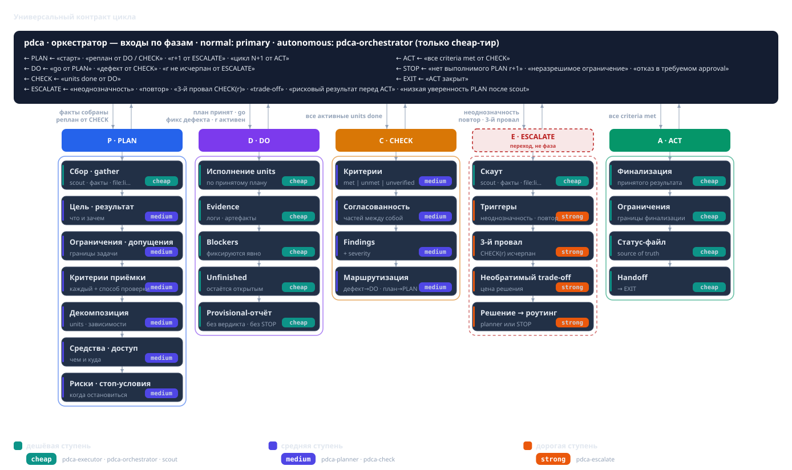
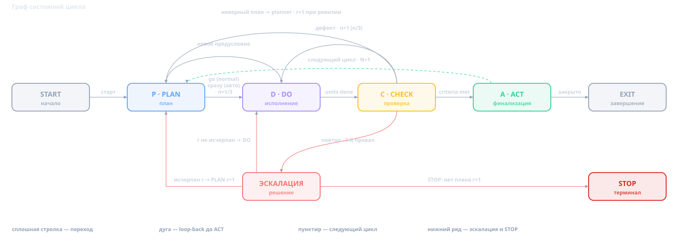

**Красным — маркеры ИИ-стиля** (антитезы «не X, а Y», афоризмы-концовки, «честно», шаблонные связки, канцелярит контракта, триады). Файл — рабочая копия, не для публикации.

# Когда вайбкодинг надоел

Агент является новой средой разработки, который фактически заменяет существующие IDE. В нем, имея лишь промпт, вы может выполнять все теже самые функции по разработке, что и в любой другой IDE (написание кода, тестов, рефактринг, синтаксический анализ и проч.). Просто способ написания кода изменился. Вы пишете на естественном языке что хотите сделать и харнес это делает (ищет файлы, правит код, запускает команды). Харнес с помощь модели очень быстро понимает что вы хотите и реализует за минуты то, что раньше занимало у вас день.

Это очень хорошо и кажется что может пойти не так? Со временем вы начинаете замечать неприятные вещи, например, модель, которая еще вчера понимала вас с полуслова, почти угадывала ваши мысли, писала быстро и качественно, сегодня почему то тупит: задает глупые вопросы, лезет смотреть документацию в интернет, перечитывает опять целиком ваш репозиторий и т.д. Вы опять тратите время и деньги на ее дообучение (погружение ее в контекст в прямом смысле слова).

Далее вы начинаете замечать, что она может отрапортовать готово, при этом ничего не сделав или сделав совершенно не то, что вы говорили. Вы начинаете ей недоверять и тратите время на углубленный ревью ее творчества.

Столкнувшись с такими проблемами, вы начинаете описывать различные правила поведения и пытаетесь заскриптовать работу модели через написание скилов.

Я тоже через это прошел, у меня были несколько вариантов скилов под различные задачи, различные артефакты разработки и входные параметры. Но в какой то момент времени, я вспомнил про старый добрый цикл  **Plan — Do — Check — Act**, который давно прижился в разработке, и переложил его на работу с моделью — в виде скилла `pdca`.

## С чего все начинается

Первые месяцы я был впечатлен промпт-инженерингом:

- **Низкий порог входа.** Вам Не нужно помнить синтаксис, библиотеку и конкретный API, вам достаточно описать словами, чего хочешь и все подключения сложных библиотек и вызовы их методов, которые раньше нужно было изучать и вречную кодить - магически сами собой начинают работать.
- **Обратная связь мгновенна.** Правка, запуск, следующая правка занимают секунды, без танцев с бубном, чтения документации, поиска примеров на stackoverflow.
- **Вы не забиваете голову мелочами.** Обвязку, конфиги, опечатки модель закрывает, пока вы держите в голове замысел.
- **Для одноразового решения это идеально.** Прототип, скрипт «на сегодня», демо идеи, проверка незнакомой технологии для вайбкодинга идеальные задачи.

## Чем все заканчивается

Проблемы начинаются, когда от результата нужно больше, чем «выглядит работающим». Когда нужна повторяемость, стабильность, прозрачность подход начинает буксовать. 

Когда модель говорит «Готово» нет Критерия, что задача выполнена. Это ее оценка, а не факт, который можно проверить. Другие минусы:

- **Состояние живёт в одной сессии.** После сжатия контекста или в новой сессии непонятно, где остановились, что сделано и почему. Когда  обнуляется Контекст работу приходится начинать заново.
- **Ошибки не наказываются.** Неудача не мешает попробовать ещё раз тем же способом, поэтому есть риск скатиться в цикл без выхода.
- **Результат не воспроизводится.** Тот же запрос к той же модели даёт другой ответ. Какой из этих ответов верный?

Все это приводит к непредсказуемости: вайбкодинг может дать результат, но не обещает, что он вас устроит, а если устроит, нет гарантии что его удастся повторить.

## Ок, что делать дальше?

Сначала я копил удачные промпты. За пару месяцев из них сложился набор скиллов, которые помогли мне достичь повторяемсости и определенного качества. Я говорил модели где искать, что считать критерием готовности, как проверять результат. Скилы задавали четкие рамки и требовали результата в нужно формате. В целом они здорово помогали, но до определенного момента.

Если задача была сложной, она становилась длинной, контекст рос, лимиты улетали за минуты, а деньги на апи тарифах сгорали еще быстрее. Держать большую длинную задача целиком на дорогой модели дорого. Переключаться на дешёвую — значит каждый раз заново выгружать контекст. Вы начинаете думать о том, как съкономить, а не о том, как решить задачу.

Чтож, идею я не выдумывал, просто мой очередной скил стал подозрительно мне напоминать управленческий цикл Plan — Do — Check — Act. Так что я взял существующие наработки, согласовал их стеорией по PDCA и получился скилл `pdca`.

Ок, случилось чудо? Ну разумеется нет! Первое с чем я сталкнулся после запуска скила, то Что стало дольше. Цикл жёстко задаёт рамки рассуждения модели и требует проверяемого результата: например, после изменении производительность не должна деградировать или покрытие не должно упасть, и это надо не просто заявить, а доказать. При таком подходе уже не побалуешся с простым рефакторингом, цикл засядет за ним на минут 20-30, хотя раньше в режиме промпта это делалось также быстро как и в IDE. Но взамен я получил две важные вещи. 
1. результат, который сталы проверяемым и предсказуемым . 
2. качество, которое стало заметно выше.

## Как работает цикл

Цикл определяет фиксированный набор ролей, за которой закрепляется набор функций и прав. У роли есть атрибут - Тир, который описывает сложность задач которые возлагаются на эту роль. Сложность задач определяет модель, которая больше всего подходит для их решения. Я выделил три уровня - cheap / medium / strong. Тир это ярлык стоимости и качества модели. Другой атрибут роли - права. Они также зависят от решаемых задач. Сильная модель как это ни странно, будет иметь меньше прав, чем дешевая. Об этом эффекте будет изложено в разделе экономики. В различных харнесах роли реализуются по разному, лично я сижу в opencode и там это отлично ложиться на сущности субагентов. Скил ничего не знает по модели и права, он оперирует только ролями. Харнесс реализует роль с помощью субагентов, задавая им конкретные модели и права.

| Роль | Что делает | Тир |
|---|---|---|
| GATHER - Скаут | Собирает указатели `file:line`, URL, числа; без рекомендаций | cheap |
| PLAN - Аналитик | Цель, критерии приёмки, декомпозиция, риски, способ проверки | medium |
| DO - Исполнитель | Правит файлы, запускает команды, ведёт статус-файл | cheap |
| CHECK - Аудитор | Независимо проверяет каждый критерий по фактическим свидетельствам | medium |
| ESCALATE - Эксперт | Инстанция для трудных решений | strong |
| RUNNER - Оркестратор | Ведёт цикл, ничего не читая и не правя | cheap |

Далее в скиле задаются правила взаимодействия ролей:

- **Оркестратор** ведёт цикл, но ничего не читает и не меняет. Он только диспетчеризует роли через `Task` (инструмент запуска субагента) и передаёт им информацию друг от друга. План он не пишет, файлы не читает, команды не запускает; исключение - обновление списка задач.
- План всегда за **аналитиком** Он и составляет начальный план, и пересматривает его, когда приходит соответствующий сигнал.
- Писать и запускать может только **исполнитель** - включая статус-файл.
- **Аудитор** не зависит от автора. Он судит по агрегированному отчёту со свежими прогонами и фактами от скаута.

Далее задаются ограничения: 
 - Испонитель не может завершить работу с любым статусом, конечный статус определяет аудитор. 
 - писать и запускать (exec) может только исполнитель, иначе источник изменений размножается. 
 - Средние и сильные тиры не работают с сырой информаций. Прочитанный файл или скаченная из интернета документация попадает в контекст целиком, хотя для принятия решения воозможно нужна только одна строчка. поэтому сырые данные читает только скаут и возвращает указатели оркестратору, который дальше диспетчеризует это более сильным ролям.

## Как идёт цикл

Машина состояний цикла выглядит так:

*[Блок отсюда до раздела «Что я измерил» — почти дословный пересказ контракта скилла из отклонённой версии: термины, счётчики, гейты. Главный кандидат на сокращение.]*

**PLAN.** Аналитик декомпозирует цель и отвечает на вопрос, какой результат нужен. Цель должна присутствовать на входе в цикл: она сформулирована заранее и не может быть изменена. Декомпозиция идёт до атомарных неделимых задач с чёткими границами — **юнитов**. Юнит — один проверяемый кусок работы со своими критериями приёмки. Обязательные поля плана:

- цель и ожидаемый результат;
- ограничения и допущения;
- критерии приёмки — **каждый со способом проверки**;
- декомпозиция с зависимостями или явное решение не дробить;
- средства и доступ;
- риски и условия остановки.

Пробел в исходных данных закрывается фактом, явным допущением или блокером. Догадки запрещены.

**DO.** Исполнитель делает только то, что сказано в плане; изменение за пределами юнита — «Over-Reach» — отдельная задача. Вердикт и STOP не его: он возвращает оркестратору **предварительного кандидата со свидетельствами**, и ответ «результат достигнут» никогда не закрывает цикл. Вердикт принадлежит CHECK.

**CHECK.** Аудитор судит каждый ответ **по фактическим свидетельствам** и проверяет, что они не противоречат друг другу. Статусы: `met` (выполнен), `unmet` (не выполнен), `unverified` (не проверен). Отсутствие проверки — не пропуск: без чисел и указателей критерий получает `unverified`, а не `met`. На выходе — вердикт, матрица критериев, находки и маршрутизация: дефект реализации возвращается в DO, неверный план — в PLAN.

**ACT.** Завершает цикл: фиксирует выводы, ограничения, статус и передачу дел, финализирует статус-файл. Без ACT цикл не закрыть, а без принятой проверки нет ACT. `rework` и `replan` — не часть ACT, а **возвраты до** него.

**Возвраты.** `CHECK → DO` — дефект реализации: исправить и проверить снова. `CHECK → PLAN` — неверный план: аналитик выдаёт новую ревизию. `DO → PLAN` — новое предусловие или блокер: не самовольный пересмотр, а кандидат на разбор аналитиком.

Когда посреди работы набор юнитов меняется, важно различать два случая.

Если выясняется, что перед текущим юнитом нужно сделать ещё один, то в план просто *добавляют* новый активный юнит, а исходный остаётся в статусе `blocked` и сохраняет все свои критерии. Маппинга между ними нет и не нужно: новый юнит не заменяет старый, а лишь идёт перед ним — когда он сделан, исходный разблокируется и доводится до `done` по своим же критериям. Это называется **аддитивное предусловие**.

Если исходный юнит больше не достижим, его вытесняет новый. Исходный помечается `superseded`, и это уже настоящая подмена. Чтобы при вытеснении не потерять требования, обязателен маппинг «вытесненная → замена»: новый юнит наследует все критерии исходного, и CHECK проверяет их по-прежнему. Без такого маппинга вытеснять нельзя — иначе часть требований тихо испарится. Это называется **замена области**.

Коротко: при аддитивном предусловии исходный юнит живёт дальше (`blocked`) и маппинга нет; при замене области он умирает (`superseded`), и маппинг со всеми его критериями обязателен.

**Пять гейтов** разрешают переходы:

1. **План → DO:** все обязательные поля на месте, план записан в статус-файл, получено подтверждение от пользователя или оркестратора.
2. **DO → CHECK:** все активные, не вытесненные юниты `done` со свидетельствами.
3. **CHECK → ACT:** все критерии `met` на фактических данных, ни одного `unmet` или `unverified`.
4. **ACT → EXIT:** результат и статус-файл финализированы.
5. **STOP:** отдельная финализация, вне ряда переходов выше.

Нерушимы два инварианта: **нельзя пропустить CHECK** и **нельзя закрыть цикл без ACT**.

Прогресс считают **три счётчика** и **история дефектов**:

- `N` — номер цикла задания в имени файла `.pdca/status/<task>-<N>.md`; растёт только в ACT, когда планируется следующий цикл того же задания.
- `r` — ревизия плана; растёт только при действительно другом плане.
- `n/3` — попытка исполнения текущей ревизии: старт с 1, `CHECK → DO` увеличивает, новая ревизия сбрасывает в 1.
- **История дефектов** — по строке на стабильный ключ дефекта: ревизии и попытки, число исправлений, указатели, исход эскалации. Не стирается ни пересмотром, ни новой сессией.

Отклонённый кандидат с неизменным планом — **не** ревизия: `r` и `n` не меняются, а переименование или сброс сессии ревизию не «производят». Счётчики и история живут в статус-файле и помогают отличить «ещё одну попытку» от пересмотра и вовремя позвать эскалацию: **повтор того же дефекта после одного исправления** — сигнал раньше, чем три разные неудачи. После третьего провала CHECK на одной ревизии четвёртой попытки нет.

**Режимы.** В **normal** после записи плана оркестратор показывает его суть, даёт путь к статус-файлу и просит подтвердить — это единственный сигнал старта. Без подтверждения ничего не создаётся и не редактируется, кроме статус-файла. В **autonomous** тот же контракт идёт без пауз: переходы случаются в тот же ход, когда пройден гейт, ничего «для пользователя» не печатается, а уведомления (недоступная роль, восстановление после сжатия контекста, допущение вместо вопроса) пишутся в статус-файл как `Notice:`.

**Память и доказательства.** Статус-файл цикла — источник истины по плану и прогрессу. Он лежит на диске, переживает сжатие контекста и новую сессию, и исполнитель обновляет его на каждом событии. Todo-список в сайдбаре — лишь сессионное зеркало и источником истины не бывает. После сжатия контекста состояние восстанавливают из статус-файла, а не по памяти. Цикл закрывается только на **свежих свидетельствах** — код выхода, числа, путь к логу, `file:line` — и никогда на утверждении, включая отчёты субагентов. «Должно работать» и «вероятно» — повод назначить повторный прогон: отчёт не равен результату.

## Что я измерил

Когда скилл более-менее устоялся, я захотел его проверить и устроил эксперимент. Взял одну и ту же задачу в проекте (довольно сложный проект, в котором нужно было доабвить динамические колонки) и дал её решить трижды одной и той же модели, DeepSeek Flash, в трёх разных средах: в чистом виде без скиллов, со скиллом-инструкцией на восемь шагов и с моим циклом. Каждый эксперимент был в отдельный клон репозитория, без истории и без готового ответа. Отдельно прогнал эталон из апстрима - та же фича, сделанная тем же циклом, но с обычной тиризацией: планирование и проверка на средней модели, эскалация на сильной.

| среда | время | файлов | своих тестов | P0-дефектов | стоимость |
|---|---|---|---|---|---|
| без скиллов | 16 мин | 32 | 2 | 5 | $0.20 |
| скилл | 30 мин | 37 | 7 | 4 | $0.33 |
| цикл, все роли на дешёвой модели | 78 мин | 55 | 19 | 2 | $1.19 |
| цикл из апстрима (средняя/сильная) | ≈40 мин | 48 | 16 | 2 | $0.76 |

Что мы видим - вайбкодин безусловный лидер по времни исполнения, стоиомсти и количеству дефектов. Простой скил, который родился из промптов несколько лучше сделал работу, но в два раза медленее. А вот скил pdca чемпион по качеству. Он написал значительно больше тестов и оставил вдвое меньше критичных дефектов. Чистый прогон без скилов отдал фичу с двумя тестами и пятью P0, так что стоимость и время пришлось бы увеличивать за счет правок этих ошибок.

## Как это скил проверяет себя

в том же сложном проекте была задача про кэш запросов при реализации которой, скил pdca четыре раза возвращался к одной задаче. К первому CHECK он нашёл в собственной правке шесть дефектов. CHECK сказал «не принято», и работа ушла обратно в DO. Так продолжалось три раза подряд (возвращение работы аудитором), после чего на разбор позвали модель посильнее. Но и она не справилась. Задача осталась открытой, в статус-файл было  записано, что именно осталось нерешенным. Фишка не в том, что что скил такой умный, а то что он не сказал «готово», когда задача была реализована. Он пошел ее проверять и зарепортил incomplete, потому что определенные при плаинровании критерии приемки не прошли. Вайбкодинг в таком кейсы, закрыл бы задачу как выполненную потому что у него нет definition of done и вы бы вернулись к ней, только после бага на проде либо гневного отзыва от пользователя. Но за все нужно платить. Главные минусы скила pdca:

- Скил работает сильно дольше. Простая задача из получаса превращается в часы.
- Скил потребляет больше токенов. Работают несколько ролей, часть на среднем и дорогом тирах, а независимая проверка требует свежих прогонов.
- Скил более сложен в плане усройства и в плане эксплуатации. Нужно поднять роли и тиры, следить за статус-файлом и гейтами. Порог входа выше, чем у одного промпта.

Таким образом, На маленькой разовой задаче цикл pdca не окупится — там проще подсказать модели вручную, что и где поправить. Цикл стоит брать для длинных задач с большим контекстом где вам важен результат и качество.

## Экономика тиров

Формализованный скил дороже по времени, токенам и деньгам. Но это верно, пока сравнение идёт с одним-двумя промптами. На простых задачах, где контекст никуда не теряется, вайбкодинг дешевле, и цикл не нужен. На сложных цена вайбкодинга складывается не из промптов, а из перезапущенных сессий, повторных объяснений задачи, ревью кода и часов разработчика на восстановление нити рассуждений. Чем сложнее задача, тем дороже и неэффективнее вайбкодинг. Поэтому если мы хотим сравнить по деньгам, то честное сравнение не «промпт против цикла», а «день вайбкодинга против дня в цикле».

В хорошо декомпозированном цикле почти все токены уходят на механику: прочитать файл, применить правку, прогнать тесты, собрать выдержки. Суждение о том «что делаем дальше», «зачтено ли» случается редко и по природе своей коротко и компактно. Объёмные и механические работы идут на cheap тип, суждение и арбитраж - на medium и strong. За Качество при этом отваечает не умная и дороная модель, а устройство цикла pdca.

Срез с моего реального использования: 12 часов работы, 159 сессий, 3829 сообщений, $7.34.

| Тир | Сообщений | Вход, ток. | Выход, ток. | Стоимость | Доля бюджета |
| --- | --- | --- | --- | --- | --- |
| cheap | 3485 (91%) | 371.1M | 3.12M | $4.44 | 60% |
| medium | 113 (3%) | 3.36M | 116.5k | $2.70 | 37% |
| strong | 4 (0.1%) | 50.4k | 11.5k | $0.20 | 3% |

Вход здесь — все входные токены, включая чтение и запись кэша; выход — ответ вместе с reasoning.

О чем говорит эта таблица? Сильный тир подключался на четыре вызова за двенадцать часов. Он почти не работает по сравнению с другими ролями, поэтому его относительная дороговизна теряется в общих расходах.
Средний тип подключался значительно больше. Это говорит о том, что было много проверок дешевого тира и большое количество раундрипов обратов в DO. Это дорого, но тоже меньше 40% от общих расходов.

Тут необходимо еще отметить тонки момент с prompt cache. У дорогих моделей разница между записью в кэш и чтением из него кратная: в моём сетапе на strong чтение $0.2/M против записи $5/M, в 25 раз. Замер на живом сеансе: тёплый повторный ход с полным попаданием в кэш обошёлся в $0.0034 против $0.0794 у холодного, в 23 раза дешевле.

наибольший источник расходов - собственно кодинг. И не удивительно, если посмотреть на кол-во токенов, которое он перелопатил за это время. Если предположить, что это бы делала средняя модель, то один кодинг за эти двенадцать часов стоил бы около $59 вместо $2.76, а вместе со скаутом — около $75 вместо $3.74. На флагманских моделях это было бы уже около $150 и это без учета записи и чтения кеша, которые у дорогих моделей платные.

## Заключение

Скил pdca не является серебрянной пулей, но он дает чуть больше гарантий по качеству и обещает честный результат. Он не даёт закрыть работу как выполненную без проверки, а если проверка не удалась, репортит о неудаче. Таким образом вы получаете предсказуемость и повторяемость.

## Открытый код

Скиллы, о которых шла речь, — `pdca` и прикладные `pdca-coder`, `pdca-dotnet`, `pdca-collection` — открыты: <https://github.com/AlexeyShirshov/skills>.
